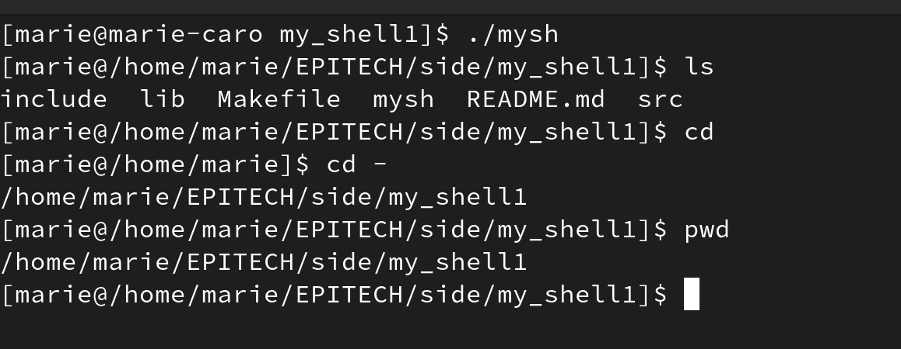
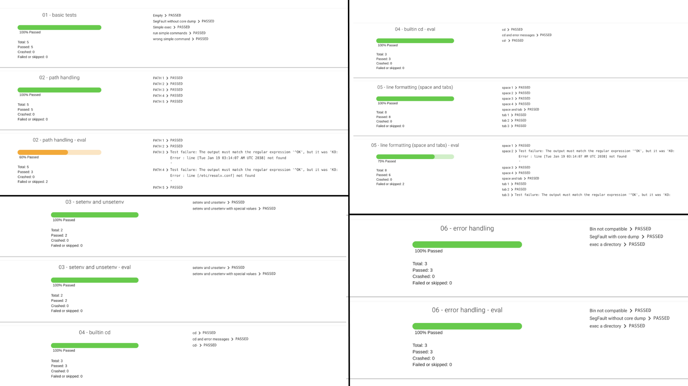

# Minishell-1

# How to run the project
```
$ ./mysh
```

# Description
We had to program a UNIX command interpreter based on TCSH.
-> The interpreter was expected to display a prompt and then wait for us to write a command line, which was to be validated by a newline.
-> The prompt was to be displayed again only after the command execution.
-> Only basic command lines are expected to be executed; no pipes, redirections or any other advanced features.
-> We had to recode some built-ins:
    * cd
    * env
    * setenv
    * unsetenv
    * exit
   for the rest of the commands, we had to find them with the PATH variable (from the env) -> for example finding the 'ls' executable in /usr/bin/ls
   
# Preview


# Results
From the final tests, my shell passed 91.5% of the tests:


# Epi students:
-> Some commands tested by the mouli:
```
$ cp /usr/bin/ls file
$ mkdir dir
$ mv file* dir
$ dir/file -l /bin
```
-> this should execute 'ls -l' in the /bin directory.

```
$ ./file_without_permissions
./file_without_permissions: Permission denied.
```
-> 'You should output an error message when trying to execute a file that doesn't have the rights.

```
$ ./with_permissions
./with_permissions: Exec format error. Wrong Architecture.
```
-> When executing a something that isn't compatible with the architecture of your pc (man errno).

